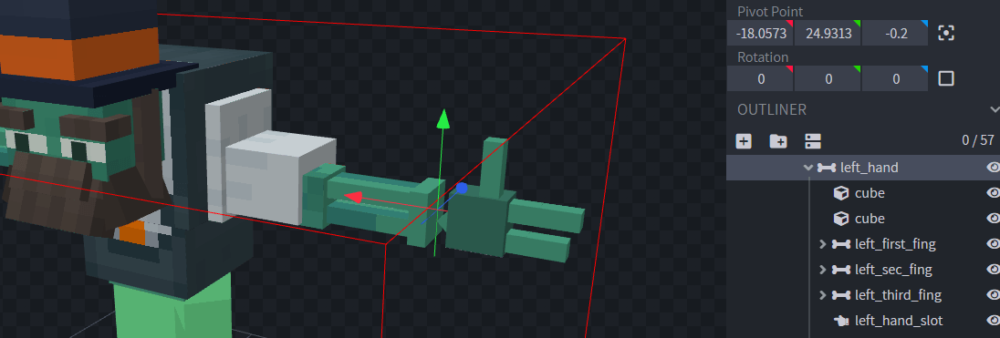

# Hands Equipment

## Show custom entity hands equipment



## How to configure hands locations

Open your `.iaentitymodel` model file with **Blockbench**.

Select the base bone of the entity hands.

Create a new group which will be a child of the hand bone.

Right click on the bone and select "**Bone Config**", in this case `left_hand_slot`

Check the "**Left hand pivot**" option and press "**Confirm**".

The hand pivot bone has a new icon now, as you can see.

Follow the same steps to specify the right hand, then you have to export the model as usual.


[advanced-method.md](advanced-method.md)

