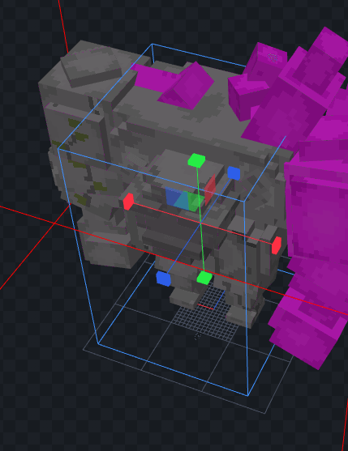

# Hitbox

## Setup

### Configure the head bone

Open your `.iaentitymodel` model file with **Blockbench**.\
Create a new bone, it can have any name.

Resize your hitbox.


* XYZ position doesn't matter.
* Only XY size matters, Z does not. This is a Minecraft limitation, it's how hitboxes work in the game.


Rightclick on the bone and select "**Bone Config**"

Check the "**Hitbox**" option and press "**Confirm**".

