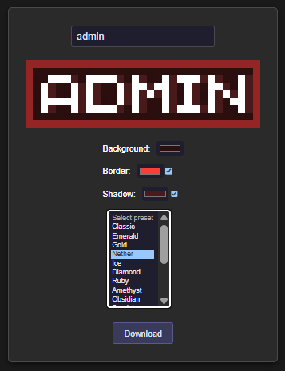
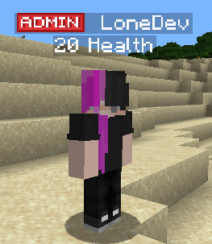

# Ranks / prefixes


**You have to use** [**LuckPerms**](https://www.spigotmc.org/resources/luckperms.28140/) **and** [**TAB**](https://www.spigotmc.org/resources/tab-1-5-1-21-4.57806/) **to follow this tutorial, the method may differ if you're using other permissions and TABs plugins.**



Download the example ranks [here](https://www.spigotmc.org/resources/ranks-betterranks-with-custom-textures-for-itemsadder.84852/).

## Create a rank

Create a new file `contents/myranks/config.yml`.

```yaml
font_images:  
  admin:
    permission: "ranks"
    show_in_gui: true
    suggest_in_command: false
    path: "font/admin.png"
    scale_ratio: 9
    y_position: 8
```


Don't change the PNG image height (keep it 8px), do not change `scale_ratio` and `y_position`.\
It would make the ranks look pixelated.


### Official tool to create custom ranks



<figure><figcaption><p><a href="https://itemsadder.github.io/minecraft-rank-generator/">https://itemsadder.github.io/minecraft-rank-generator/</a></p></figcaption></figure>

Put the image into `contents/myranks/textures/font/admin.png`.

#### Create a group (for example `admin`)

Command `/lp creategroup admin`

#### Add the prefix

Open the editor `/lp editor`.

Click on the link and open the web editor.\
Select the role. In this case `admin`.


Add a new permission:`prefix.100.:admin:` . Change `:admin:` based on your rank name.


Press <mark style="color:green;">**`+Add`**</mark>


You now have a new line in the permissions list, this is the prefix setting.


Save your changes.


#### Assign the group to a player

Use this command (change `LoneDev` to your player name) `/lp user LoneDev group add admin`


## TAB plugin


Make sure you installed [PlaceholderAPI](https://modrinth.com/plugin/placeholderapi)


#### Editing the config.yml of TAB plugin

**Add** this under the `groups` category or edit it if already exists.\
(You have to use `%img_admin%` instead of `:admin:` because **TAB** recognized only **PlaceholderAPI** placeholders and not **ItemsAdder** placeholders. This can be valid also for **other plugins**)

```yaml
  Admin:
    tabprefix: '%img_admin%  '
    tagprefix: '%img_admin%  '
```

Then use the command `/tab reload`.




