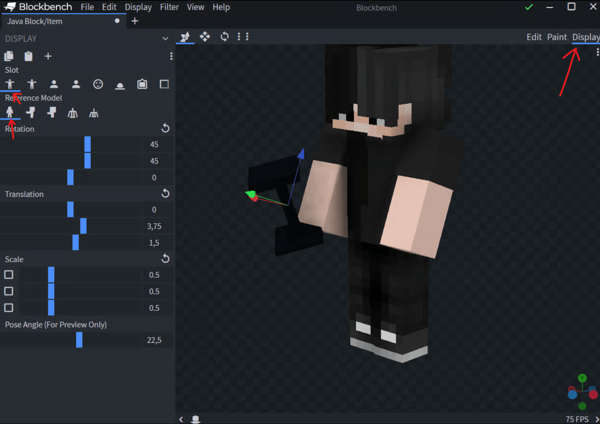
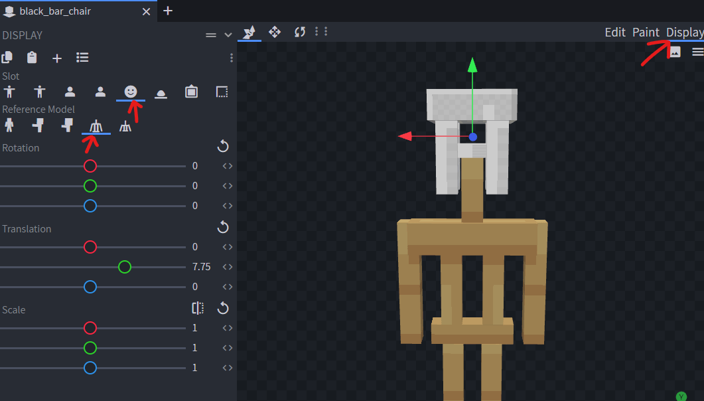
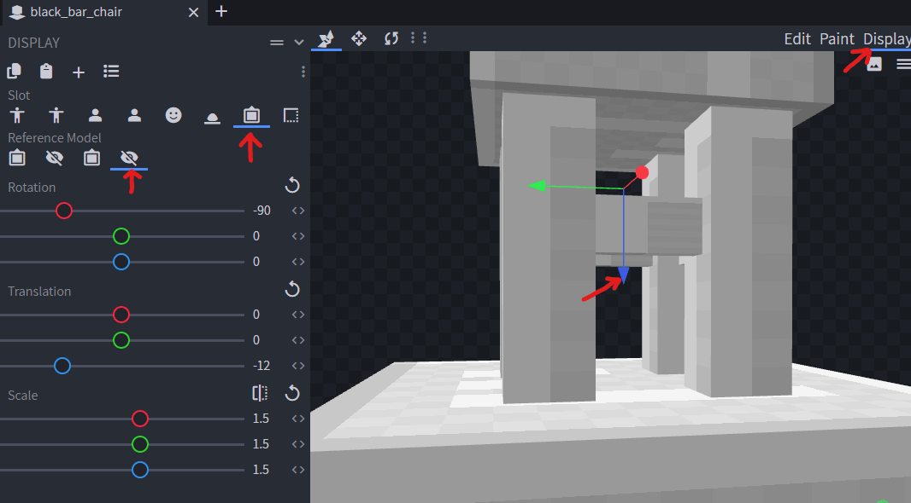

# Model

### Model file

Open **BlockBench** and create a _"Java Block/Item"_.


Create your model, in this example I'm modelling an ugly minimal modern lamp.



Important: make sure the north is opposite of where you want the model to face.

Or add the property to the YML configuration `opposite_direction: true`


Edit how the model is shown on player hand:

<div><figure><figcaption></figcaption></figure></div>


### Configure the in-game view

#### Using `armor_stand`

You have to select the **head icon** and then **small ArmorStand:**


Then you have to shift your model down until it matches the **ArmorStand** base:


#### Using `item_display`


This mode has the best performance


Make sure to specify `HEAD` in your configuration.

```yaml
    behaviours:
      furniture:
        entity: item_display
        display_transformation:
          transform: HEAD
        gravity: false
        fixed_rotation: false
```

You have to select the **head icon** and then normal **ArmorStand**.

Then move the model until it's approximately like that. It will be close to the ground. You can later regenerate your pack to preview it in-game and move the model until it's in the correct position.

<figure><figcaption></figcaption></figure>

#### Using `item_frame`

Select _Frame_ and _Invisible Top_.\
Adjust the model Z _Translation_ (the blue arrow) until it matches the bottom of the white block perfectly.

<figure><figcaption></figcaption></figure>

### Export the model

Now let's save the model file into the correct folder, in this case I set this property in the `.yml` configuration file: `model_path: lamp`, so you have to save the `.json` file inside this path: `contents/myitems/models/lamp.json`.

To achieve this, click on "File" followed by "Export Model" and finally "Export Block/Item Model". In the new window, head over to the path where you want to save your model, give it the correct name and confirm the changes.
