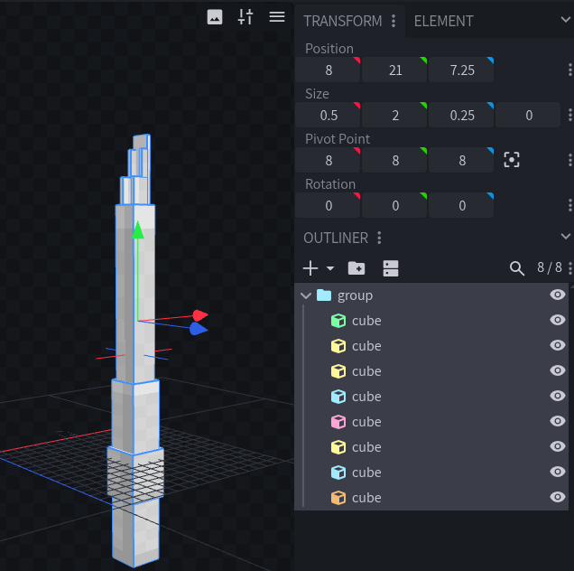
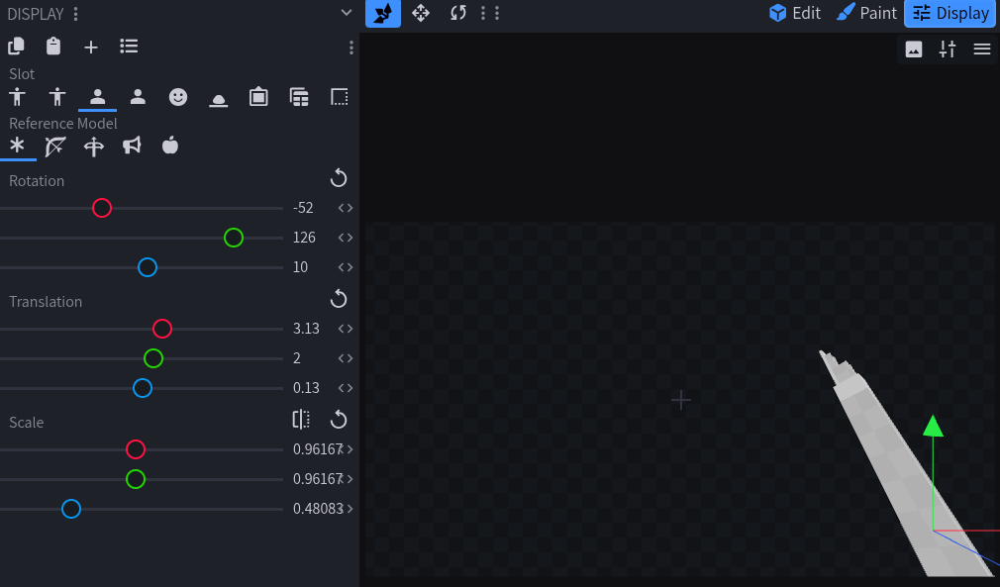

# Spear

Requires ItemsAdder 4.0.18-beta-16 or greater.


Custom spear graphics are supported for these materials:

- `WOODEN_SPEAR`
- `STONE_SPEAR`
- `COPPER_SPEAR`
- `IRON_SPEAR`
- `GOLDEN_SPEAR`
- `DIAMOND_SPEAR`
- `NETHERITE_SPEAR`

## Spear models

Spears have two model states:

- `normal`: default model used outside the player's hand.
- `in_hand`: model displayed while the spear is held.

The `normal` model is required. If `in_hand` is omitted, ItemsAdder uses `normal` for both states.

## Using custom models

``` yaml
info:
  namespace: my_spears

items:
  ruby_spear:
    name: Ruby Spear
    material: DIAMOND_SPEAR
    graphics:
      models:
        normal: item/ruby_spear
        in_hand: item/ruby_spear_in_hand
```

Place the model files here:

``` text
contents/my_spears/models/item/ruby_spear.json
contents/my_spears/models/item/ruby_spear_in_hand.json
```

Use custom models when you need a 3D model or custom display transformations.

### Creating a 3D spear in Blockbench

Open Blockbench and create/open a **Java Block/Item** model.

#### 1. Build the spear upright

- Build the spear vertically.
- Make the handle point down and the tip point up.
- Keep the shaft in the middle of your workspace.
- A long spear can extend outside the normal `0` to `16` box. Do not squeeze it to fit.

#### 2. Move the spear to the center

Imagine a pin at `[8, 8, 8]`, in the middle of the workspace. Minecraft holds and turns the complete spear around this point; `[0, 0, 0]` is only a corner.

Select every cube in the **Outliner**, then use the **Move** tool to move the whole spear until its middle is around `[8, 8, 8]`. Keep all cubes selected so the shape does not change.

Check that the shaft is still vertical and the tip points up. ItemsAdder changes how the spear is shown in hand, but it does not reposition the cubes for you.




If the spear is built around `[0, 0, 0]`, or far from `[8, 8, 8]`, it may look fine in the hand but fly across the screen during the transition.


#### 3. Set the in-hand view

Rotate one cube only when that cube is actually meant to be angled, like a blade or decoration.

For the whole spear orientation, use the Blockbench **Display** tab and set these values:

| Blockbench preview | Rotation |
| --- | --- |
| First-person right hand | `[-20, 90, 10]` |
| First-person left hand | `[-20, -90, -10]` |
| Third-person right hand | `[5, 270, 5]` |
| Third-person left hand | `[5, -270, -5]` |



Then adjust only translation and scale in the preview.

<details>

<summary>Exact measurements (optional)</summary>

- Keep shaft centered on `X = 8` and `Z = 8`, whole model around `Y = 8`, and tip toward `+Y`.

For length `L`:

- minimum Y = `8 - L / 2`
- maximum Y = `8 + L / 2`

Length examples:

| Length | minimum Y | maximum Y |
| --- | --- | --- |
| 16-unit spear | `0` | `16` |
| 24-unit spear | `-4` | `20` |
| 32-unit spear | `-8` | `24` |

For shaft width `W`:

- minimum X = `8 - W / 2`
- maximum X = `8 + W / 2`
- minimum Z = `8 - W / 2`
- maximum Z = `8 + W / 2`

Example 32-unit dimensions (only):

| Part | From | To |
| --- | --- | --- |
| Shaft | `[7.5, -8, 7.5]` | `[8.5, 20, 8.5]` |
| Spear head bounding box | `[6.5, 20, 6.5]` | `[9.5, 24, 9.5]` |

| Centering (X/Y/Z) | X | Y | Z |
| --- | --- | --- | --- |
| Before bounds | `-0.5..2.5` | `0..32` | `-0.5..2.5` |
| Model center | `1` | `16` | `1` |
| Move by | `+7` | `-8` | `+7` |
| After bounds | `6.5..9.5` | `-8..24` | `6.5..9.5` |
| New center | `8` | `8` | `8` |

Offsets to center the whole spear:

- offsetX = `8 - (minimum X + maximum X) / 2`
- offsetY = `8 - (minimum Y + maximum Y) / 2`
- offsetZ = `8 - (minimum Z + maximum Z) / 2`

When recentering, apply the same offset to both `From` and `To` of every selected cube.

</details>

## Using textures only

ItemsAdder can generate both spear models automatically from textures.

``` yaml
info:
  namespace: my_spears

items:
  ruby_spear:
    name: Ruby Spear
    material: DIAMOND_SPEAR
    graphics:
      textures:
        normal: item/ruby_spear
        in_hand: item/ruby_spear_in_hand
```

Place the textures here:

``` text
contents/my_spears/textures/item/ruby_spear.png
contents/my_spears/textures/item/ruby_spear_in_hand.png
```

The generated `in_hand` model automatically uses the correct vanilla spear display transformations.

### Using one texture

You can use the same texture for both states:

``` yaml
graphics:
  texture: item/ruby_spear
```

ItemsAdder generates separate models for `normal` and `in_hand`, both using the specified texture.

## Custom icon

Use `icon` to provide a separate inventory texture:

``` yaml
graphics:
  icon: item/ruby_spear_icon
  textures:
    normal: item/ruby_spear
    in_hand: item/ruby_spear_in_hand
```

Place it here:

``` text
contents/my_spears/textures/item/ruby_spear_icon.png
```

The icon is used in the GUI, on the ground, in item displays and on shelves.

## Testing

Reload ItemsAdder and regenerate the resource pack:

``` text
/iareload
```

Get the item:

``` text
/iaget my_spears:ruby_spear
```
