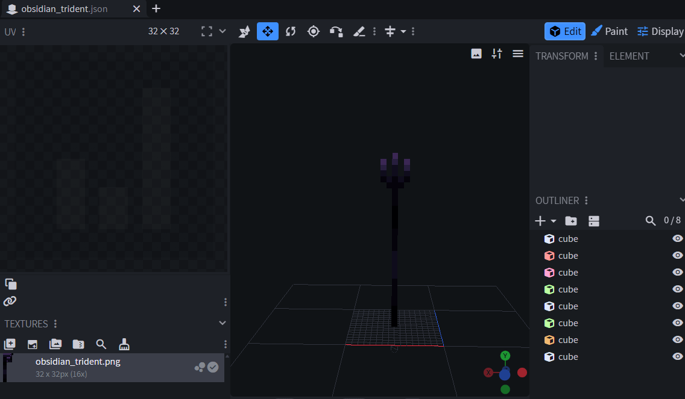
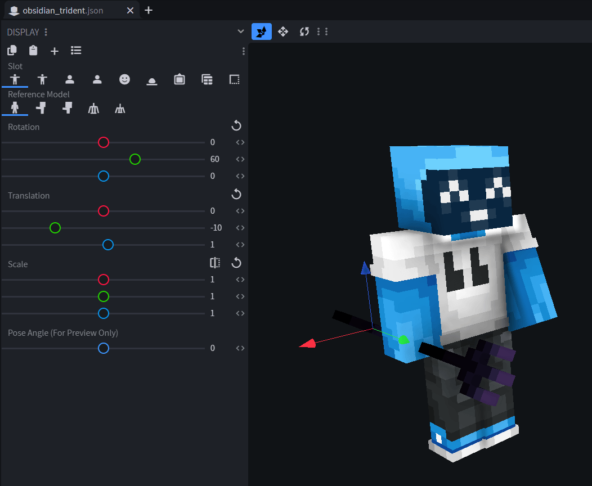
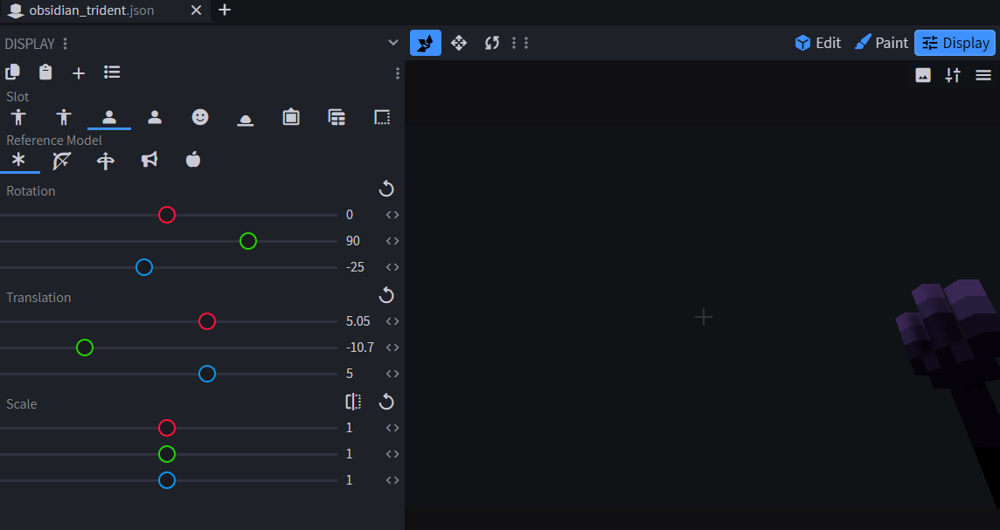
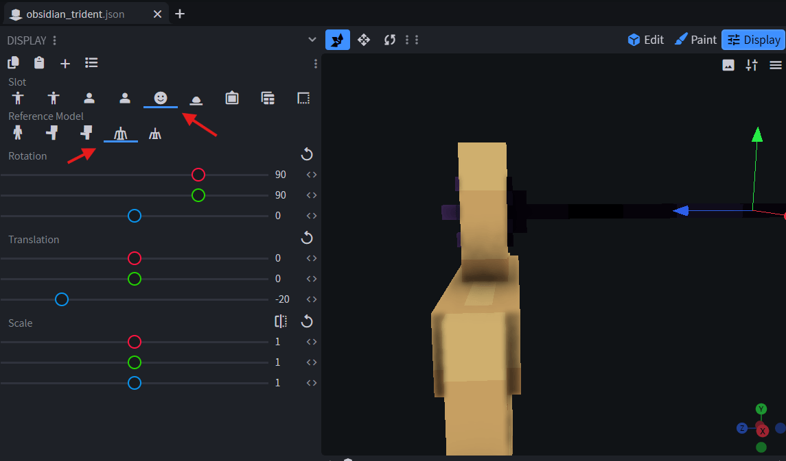

# Tridents


Available since ItemsAdder 4.0.11.

Requires Minecraft 1.21.4+ clients. Server version is not important.


## Example item: `obsidian_trident`

The `normal` model is used while the trident is held normally. The `throwing` model is used while the player is charging a throw. Model paths are relative to `contents/tridents/models/` and do not include the `.json` extension.

```yaml
info:
  namespace: tridents
items:
  obsidian_trident:
    name: <aqua>Obsidian Trident
    material: TRIDENT
    graphics:
      icon: item/obsidian_trident_icon
      models: 
        normal: item/obsidian_trident
        throwing: item/obsidian_trident_throwing
```

### Create the normal model

Create `contents/tridents/models/item/obsidian_trident.json`, either manually or with Blockbench.

<figure><figcaption>The example trident model in Blockbench.</figcaption></figure>

#### Set the held-item transforms

Use Blockbench's **Display** tab to position the trident in third-person views.

<figure><figcaption>Third-person transform preview.</figcaption></figure>

Then configure its first-person views.

<figure><figcaption>First-person transform preview.</figcaption></figure>

#### Set the head transform

The head transform controls how the model is positioned when equipped in the helmet slot.

<figure><figcaption>Head transform and reference model selected in Blockbench.</figcaption></figure>

The complete `display` section used by the normal model is:

```json
{
  "display": {
    "thirdperson_righthand": {
      "rotation": [0, 60, 0],
      "translation": [0, -10, 1]
    },
    "thirdperson_lefthand": {
      "rotation": [0, 60, 0],
      "translation": [0, -8, 1]
    },
    "firstperson_righthand": {
      "rotation": [0, 90, -25],
      "translation": [5.05, -10.7, 5]
    },
    "firstperson_lefthand": {
      "rotation": [0, 90, -25],
      "translation": [6.25, -11, 3.5]
    },
    "head": {
      "rotation": [90, 90, 0],
      "translation": [0, 0, -20]
    }
  }
}
```

### Create the throwing model

This model is shown while the player holds the use button to charge a throw. Create `contents/tridents/models/item/obsidian_trident_throwing.json`.

It can be a completely different model. For the same geometry with a different held rotation, make it inherit the normal model and override only the required display transform:

```json
{
  "parent": "tridents:item/obsidian_trident",
  "display": {
    "thirdperson_righthand": {
      "rotation": [0, 90, -180],
      "translation": [0, 11, 1]
    }
  }
}
```


Minecraft applies hardcoded rotations and translations to the first-person view of a trident while it is being thrown. Configure the throwing model's third-person transform; do not compensate for it by changing the first-person transform.


## Inventory 2D icon

You can set a 2D icon in inventory.


[2d-icon.md](item-properties/2d-icon.md)


## Done



## Example pack


[Example pack](https://github.com/bruhhhwarrior/tridents/releases)

