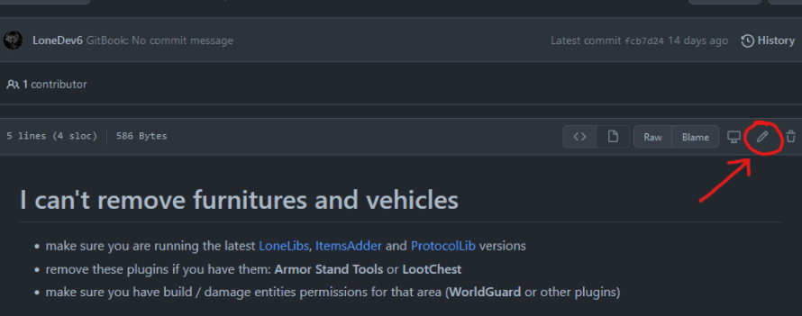
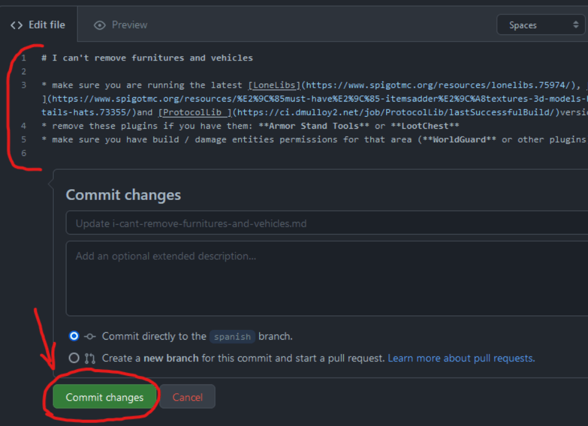
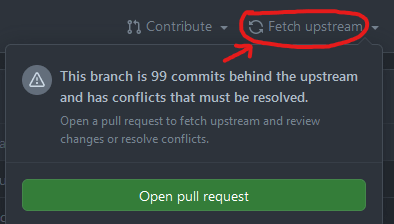
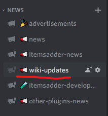

# Edit the English wiki

## How to edit this wiki?

### Setting up your repository

Open the [**GitHub** repository](https://github.com/LoneDev6/Wiki-ItemsAdder) of this wiki and press **Fork** to create your own copy.

Make sure the base branch is `master`. Keep your fork's `master` branch synchronized with the original repository, then make each contribution in a separate branch with a descriptive name.

Select the file you want to edit and press the **pencil** button.

Edit the file and use the **Preview** tab to check the rendered Markdown before continuing. Then press <mark style="color:green;">**Commit changes**</mark>, enter a short description of the change and choose the option to create a new branch for the commit.


#### Important notes

* Do not remove the `#` special characters, edit only the next text, these are titles.
* Do not remove or edit special texts inside `{ }`, for example ``, these are used to create the hint message boxes.
* Do not remove `*` character, these are used to create lists
* Do not remove emojis
* Do not edit or remove the `--- description: ---` text on top of some pages, edit only the inner text.
* Do not remove `\` on some lines end
* Keep existing links, image paths and GitBook directives unless they are part of the correction.
* Do not rename or move files unless the change specifically requires it, because other pages may link to them.


### Example of what you _<mark style="color:red;">must not</mark>_ edit

### Open a pull request

After committing the change, open a pull request from your branch to the `master` branch of `LoneDev6/Wiki-ItemsAdder`. Use a clear title and explain what you changed and why. Check the changed files once more before submitting it.

GitHub's current step-by-step instructions are available in [Creating a pull request from a fork](https://docs.github.com/en/pull-requests/how-tos/create-pull-requests/creating-a-pull-request-from-a-fork). The pull request is the place where maintainers review the contribution; Discord can still be used if you need help, but it is not required to submit an edit.

You can also read [GitHub's file editing guide](https://docs.github.com/en/repositories/working-with-files/managing-files/editing-files) if the buttons or labels differ from the screenshots on this page.

### Keep your fork synchronized


Update your fork before starting a new contribution so it includes the latest changes from the English wiki.

On the fork page, press **Sync fork**, then **Update branch**. The older screenshot below shows the previous **Fetch upstream** label. See [GitHub's guide to syncing a fork](https://docs.github.com/en/pull-requests/collaborating-with-pull-requests/working-with-forks/syncing-a-fork) for the current procedure.

\
You can keep track of changes in the Discord notification channel.


