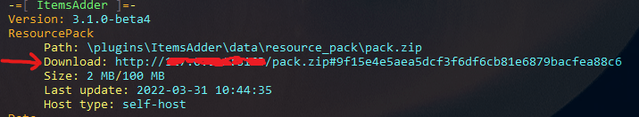

# Single resource pack on BungeeCord and Velocity


Enable exactly one hosting provider in each server's `resource-pack.hosting` section. The server that builds and hosts the pack uses its selected provider; the other servers use `external-host` with that same pack URL.


## Network-wide resourcepack

Do you want to install ItemsAdder on multiple Spigot servers of your network?\
Do you want to avoid players from downloading the resourcepack each time they change server?\
Follow this simple tutorial.

## How to set it up

For example you can have 3 servers: `lobby`, `survival`, `creative`.\\

### Step 1

Install ItemsAdder on all these 3 servers.


<mark style="color:red;">**This is very important**</mark>

Make sure to synchronize `plugins/ItemsAdder/contents/` on all three servers whenever you change items, textures, models, sounds or other pack content. The content configuration must stay consistent; only the `config.yml` hosting section changes between the source server and the other servers.

This is very crucial for this task or everything won't work.


### Step 2

Decide a main server, for example `lobby`.\
Open the `config.yml` of ItemsAdder in the `lobby` server and set up the hosting.


[resourcepack-hosting](../../plugin-usage/plugin-configuration/resourcepack-hosting/)



For ItemsAdder 4.0.17+, `simple_self_host` is the easiest option because it does not require manual port forwarding. The existing `self-host` method is still useful when you need to control the public address and port yourself.



```yaml
resource-pack:
  hosting:
    no-host:
      enabled: false
    simple_self_host:
      enabled: true
      server_address: auto
    lobfile:
      enabled: false
    external-host:
      enabled: false
      url: ''
    self-host:
      enabled: false
      server-ip: 127.0.0.1
      pack-port: 8163
```


Run `/iazip` on this source server to generate and host the resource pack.

After you finished configuring the hosting (follow the linked tutorial carefully) you have to use the `/iainfo` command and get the URL in console, copy it.

For example:




Use the direct pack URL. If the displayed text contains a fragment after `#`, do not include that fragment in `external-host.url`.


#### For example using `self-host`:

<details>

<summary>Self host example</summary>


```yaml
resource-pack:
  hosting:
    no-host:
      enabled: false
    simple_self_host:
      enabled: false
      server_address: auto
    lobfile:
      enabled: false
    self-host:
      enabled: true
      server-ip: YOUR_SERVER_IP_HERE
      pack-port: 8163
    external-host:
      enabled: false
      url: ''
```


Run `/iazip` to generate the resourcepack.

</details>

### Step 3

Open the other servers (survival, creative) ItemsAdder `config.yml` file and edit the hosting part.\
Instead of `YOUR_PACK_COMPLETE_URL` you have to put the **URL** you got from the `/iainfo` command.


```yaml
resource-pack:
  hosting:
    no-host:
      enabled: false
    simple_self_host:
      enabled: false
      server_address: auto
    lobfile:
      enabled: false
    self-host:
      enabled: false
      server-ip: 127.0.0.1
      pack-port: 8163
    external-host:
      enabled: true
      url: 'YOUR_PACK_COMPLETE_URL'
```


After changing the URL, reload ItemsAdder on the secondary servers. Open the URL in a browser as an additional check: it must directly download the generated `.zip` file.

### Step 4 (Bungeecord only)

Install the Bungeecord plugin to make the loading even faster!




<mark style="color:red;">**Do not install**</mark> <mark style="color:red;">**BungeePackFix**</mark> <mark style="color:red;">**on**</mark> <mark style="color:red;">**Spigot**</mark> <mark style="color:red;">**servers!**</mark>

This is a **Bungeecord** plugin! Install it on **Bungeecord**!

