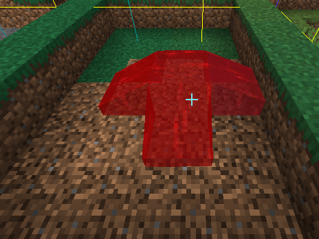
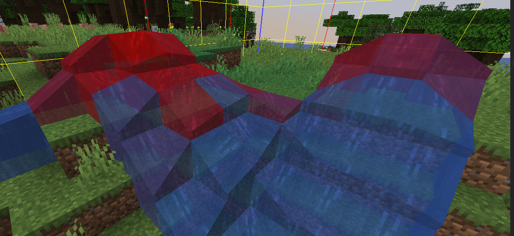
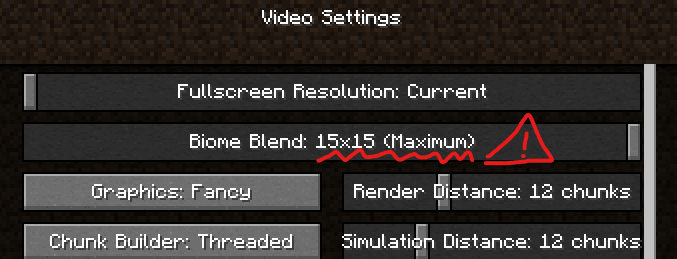
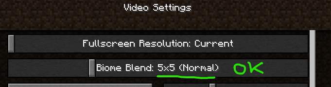

# Liquids issues


These are all Minecraft bugs I cannot fix. This is how the game works.\
Please do not report these issues.


## Liquids do not spread like water!


It's working as intended to avoid lag and glitches.\
Use multiple liquid buckets to create a larger liquid area.


<figure><figcaption></figcaption></figure>

### Custom liquid color mixed with water and vice versa

Custom liquids are not totally colored sometimes, some parts still have vanilla water color.\
This is a limitation of how the game works. I cannot fix this.

Technical reason

Minecraft stores biomes of a chunk in an int\[1024]. 16x16x256=65536, that's way more than 1024. This means that it stores it in some kind of blobs (not sure myself which size they are), so changing specific blocks is sadly not possible. The colours also fade between biomes, so changing small "blobs" always looks weird and the blocks won't have the full colour.

Source: [https://www.spigotmc.org/threads/how-to-create-custom-biomes.512105/page-2#post-4243330](https://www.spigotmc.org/threads/how-to-create-custom-biomes.512105/page-2#post-4243330)

### I cannot see liquid color at all, even by placing it in a different location

You have to set the biome blend to `5x5` or lower.

#### Bad

<figure><figcaption></figcaption></figure>

#### Good

<figure><figcaption></figcaption></figure>
