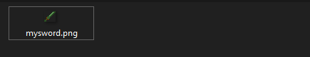

# My First Sword


**Resourcepack hosting**

Remember to **decide** a [**resourcepack hosting**](../plugin-configuration/resourcepack-hosting/) method **before** you **start**.\
For ItemsAdder 4.0.17+, `simple_self_host` is usually the easiest option. Other providers are explained in the linked hosting guide.



This tutorial uses the modern `graphics` configuration, available with ItemsAdder 4.0.13+ for Minecraft 1.21.4+ clients. If your players use older clients, keep the legacy `resource` configuration shown below.


## Creating the swords file config


This is an example sword (remember to change `my_items` namespace to the one you want).


For example I created a **file** which will contain all my **custom swords**:\
`contents/my_items/configs/myswords.yml`

In this file (`myswords.yml`) I start creating a simple sword called `mysword`


```yaml
info:
  namespace: my_items
items:
  mysword:
    name: My Sword
    material: DIAMOND_SWORD
    permission_suffix: my_items.mysword
    graphics:
      texture: item/mysword
    durability:
      max_durability: 1324
```


## Item texture

### Creating the texture file

Now the fun part, let's set the sword texture.\
To do that you have to put your sword `.png` texture file inside the correct folder.

In this case your **namespace** is `my_items` so you have to put it here:

`contents/my_items/textures/item/mysword.png`



### Applying the texture file to your item

Now open `myswords.yml` again and add the `graphics` section. The texture path is relative to `contents/my_items/textures/` and does not require the `.png` extension.


```yaml
info:
  namespace: my_items
items:
  mysword:
    name: My Sword
    material: DIAMOND_SWORD
    permission_suffix: my_items.mysword
    graphics:
      texture: item/mysword
    durability:
      max_durability: 1324
```


<details>

<summary>Legacy resource configuration for Minecraft 1.21.3 and older clients</summary>

The legacy method uses `resource`, sets `generate: true` and includes the `.png` texture path. ItemsAdder then generates the item model from that texture.

```yaml
info:
  namespace: my_items
items:
  mysword:
    name: My Sword
    permission_suffix: my_items.mysword
    resource:
      material: DIAMOND_SWORD
      generate: true
      texture: item/mysword.png
    durability:
      max_durability: 1324
```

For all legacy `resource` options, see the [resource property reference](../../adding-content/items/item-properties/resource.md).

</details>

## Final part

Now you just need to tell the plugin to load your just added item.\
To do that you have to:

* join the server
* make sure you accepted the resourcepacks
* use the command `/iazip`
* (if you're using **external-host** (**DropBox**) scroll down and follow the instructions)
* get the item using `/iaget my_items:mysword`


## Resourcepack Hosting Tutorials


[resourcepack-hosting](../plugin-configuration/resourcepack-hosting/)

